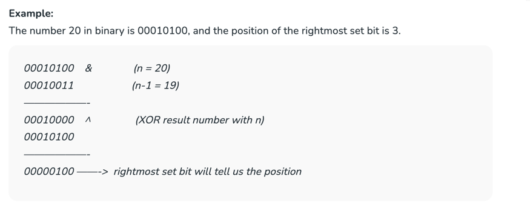

**Bit Manipulation**

**_And Operator  - (Any Zero - Zero , All 1- 1)

Or Operator (Any 1 - 1 , All Zero - Zero)

Xor Operator (Even 1- 0 , Odd 1 -1)

Negation Operator

Right shift Operator

Left Shift Operator_**

5) Calculate XOR from 1 to n

6) **Count the no of set bits**

6.1)
   while (n > 0) {
   **if ((n & 1) == 1) {
   cnt++; // if n&1 == 1 keep incrementing cnt
   // variable
   }
   n = n >> 1; // keep dividing n by 2 using right
   // shift operator
   }**

6.2)/* First x in the below expression is
for the case when x is 0 */
return x != 0 && ((x & (x - 1)) == 0); - Brian Kernighan’s Algorithm:

6.3) if ((n & (~(n - 1))) == n)
return true;

6.4)   System.out.println(Integer.bitCount(4));
System.out.println(Integer.bitCount(15));

7) Position of right most set bit

**8) Add 1 to number without + operator** 

Method 1
   To add 1 to a number x (say 0011000111), flip all the bits after the rightmost 0 bit (we get 0011000000). 
   Finally, flip the rightmost 0 bit also (we get 0011001000) to get the answer. 